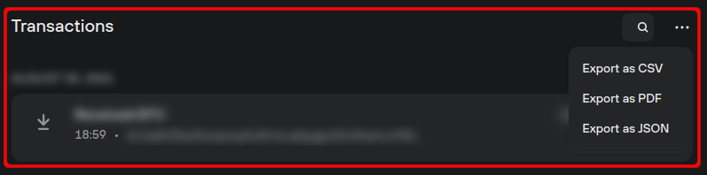

# Overview of transactions

Trezor Suite displays information about individual transactions for each of your cryptocurrency accounts.

This information can be found in the **Transactions** section of the account overview, directly underneath the graph view:

<figure><figcaption></figcaption></figure>

You can export the list of transactions to CSV, PDF or JSON via the drop-down menu.

Each entry displays the transaction timestamp, address, and amount. More detailed information can be seen by clicking on the entry.

> 💡 Learn more about [addresses and transaction history](https://trezor.io/guides/trezor-suite/trezor-suite-desktop/addresses-transaction-history) on the Trezor knowledge base
