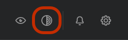

# Tor

Přepínač **Tor** je funkce ochrany soukromí dostupná v desktopové aplikaci Trezor Suite. Tor zvyšuje vaše soukromí tím, že výrazně komplikuje dohledání vaší komunikace k jedné konkrétní zemi, lokaci nebo IP adrese.

#### Zapnutí Toru v Trezor Suite

Chcete-li Tor aktivovat, klikněte na ikonu Tor na pravé straně horního panelu nástrojů:

<figure><figcaption></figcaption></figure>

Poté několik sekund vyčkejte, než se spojení naváže.

Jakmile se připojení podaří, na ikoně se zobrazí zelené zaškrtnutí. Veškerý síťový provoz z Trezor Suite bude nyní směrován přes Tor.

Protože Tor vede spojení na delší vzdálenosti a přes více uzlů, může dojít k vyšší latenci u akcí, které přenášejí data po síti.

#### Vlastní nastavení Toru

Pokud se chcete připojit ke konkrétní instanci Toru, můžete změnit výchozí IP adresu.

Můžete také otevírat libovolné odkazy [**trezor.io**](http://trezor.io) ve formátu **.onion**. Tyto odkazy představují „.com“ Tor sítě a jejich použitím zabráníte pozorovatelům zjistit, jaké odkazy z aplikace navštěvujete – například **Průzkumník bloků SatoshiLabs.**

> 💡 Další informace o používání [Toru v Trezor Suite](https://trezor.io/guides/trezor-suite/trezor-suite-desktop/tor-in-trezor-suite) najdete v Trezor Knowledge Base.
