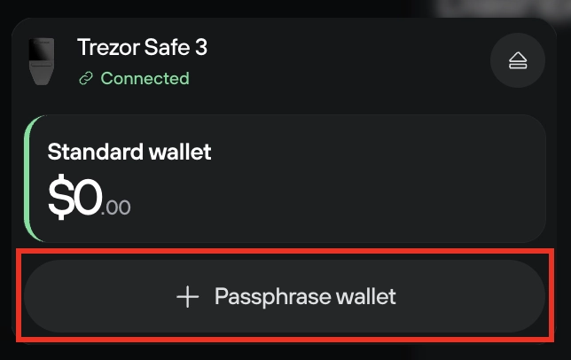
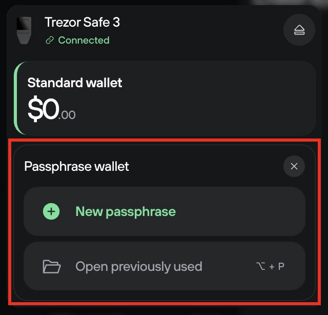

# Passphrase

A passphrase functions like an extra word added to your wallet backup (recovery seed). Each unique combination of 'wallet backup + passphrase' grants access to the corresponding, unique **passphrase wallet.**

**Passphrases are not stored on your Trezor**, and using a strong passphrase means your coins are extra safe.

> ⚠️ **If you forget a passphrase, you lose access to any associated funds.** Only use the feature once you understand how it works.

#### Critical information about passphrases

* Passphrases are not stored anywhere on the device. **A passphrase cannot be recovered.**
* A passphrase can be any character or set of characters, a word, or a sentence up to 50 bytes long (\~50 [ASCII](https://ascii.cl/) characters).
* Passphrases are case-sensitive - lowercase and uppercase characters are distinguished and count as different.
* Spaces are counted as valid characters.
* Your passphrase and wallet backup (recovery seed) are used together. Neither can be used without the other. Coins sent to a passphrase-protected wallet can only be recovered with access to both the wallet backup and passphrase.
* There is no limit to the number of passphrase-protected wallets that can be used.
* Entering the 'wrong' passphrase will simply create another (empty) passphrase wallet.

#### Using a passphrase-protected 'hidden' wallet in Trezor Suite

* Click on the wallet switcher in the top-left corner of Suite, then select **'+ Passphrase wallet':**

<figure><figcaption></figcaption></figure>

* You can then enter a **New passphrase** (i.e., create a brand new hidden wallet) or select **Open previously used** to access your existing passphrase-secured funds:

<figure><figcaption></figcaption></figure>

* When creating a new passphrase wallet, you'll need to confirm that you understand the risks of using a passphrase, namely **if you forget a passphrase then you lose access to the funds stored in that specific passphrase-protected hidden wallet**.
* Enter your passphrase; you can do this either through Suite or you can enter the passphrase directly on your Trezor device.
* Confirm the passphrase on your Trezor.
* You'll then need to enter and confirm your passphrase once again.
* That's it, you've created a passphrase wallet! Use the wallet switcher to change between your loaded wallets as required.

Additional passphrase wallets can be loaded at any time via the wallet switcher. Just make sure you enter the **exact** passphrase each time.

> 💡 Learn more about [passphrases and hidden wallets](https://trezor.io/guides/backups-recovery/advanced-wallets/passphrases-and-hidden-wallets) on the Trezor knowledge base.
