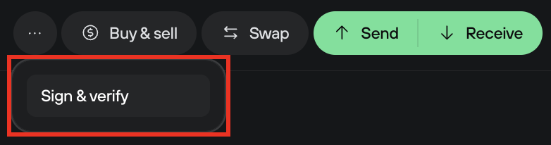

# Electrum compatible signatures

Electrum compatible signatures allow Trezor users to sign and verify messages using the Electrum signature format.

This is in addition to the Trezor signature format that is compliant with [BIP-137](https://github.com/bitcoin/bips/blob/master/bip-0137.mediawiki).

#### Signing a message using the Electrum format in Trezor Suite

* Go to the **Accounts** page in Trezor Suite.
* Select the account in question from the **My accounts** sidebar menu.
* In the Overview page of the account, click the three dots in the menu bar, which will reveal the **Sign & Verify** tab:

<figure><figcaption></figcaption></figure>

* Write a message in the **Message** box and select an address from the drop-down **Address** menu.
* Next to the **Address** box, you can switch the format from **‘Trezor’** to **‘Electrum’**
* Then click **‘Sign’** and confirm the action by following the instructions displayed on your Trezor device.
* Once confirmed using your Trezor, the signature will appear in the **Signature** box in Suite.

> 💡 Learn more about [message signing & verification](https://trezor.io/guides/trezor-suite/trezor-suite-desktop/sign-and-verify-messages-trezor-suite) on the Trezor knowledge base
