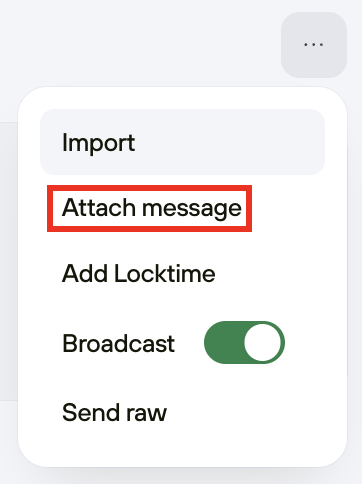

# Attach message (OP\_RETURN)

This bitcoin feature provides a memo field for transactions. Usage is limited to one 80 byte message per transaction to prevent network congestion.

Messages stored on the blockchain can not be censored, and will be viewable as long as Bitcoin exists.

#### How to attach a message

1. Create a transaction by entering a recipient address, amount and fee.
2. Click the ellipsis (...) to reveal the drop-down menu, where you will find the **Attach message** option:

<figure><picture><source srcset="../../../.gitbook/assets/Attach_message_dark-HL.png" media="(prefers-color-scheme: dark)"></picture><figcaption></figcaption></figure>

3. Select this to reveal the **Attach message** field.
4. Enter your memo into the left text box. On the right, your message will be shown in hexadecimal.
5. Click **Review & send.** Confirm all details on your Trezor and finish the transaction.
6. Once confirmed, the hexadecimal data can be retrieved and decoded from the bitcoin blockchain.

> 💡 Learn more about [Attach message (OP\_RETURN)](https://trezor.io/guides/trezor-suite/trezor-suite-desktop/use-op-return-in-trezor-suite) on the Trezor knowledge base
