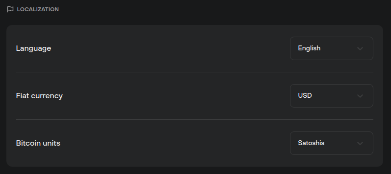

# Localization

The **Localization** menu lets users make quick adjustments to Trezor Suite, allowing for a more personalized user experience. It can be found in **Settings (⚙️) > Application:**

<figure><figcaption></figcaption></figure>

The following settings can be changed:

* **Language:** Suite is currently available in Czech, German, English, Spanish, French, Brazilian Portuguese, Korean and Japanese (Official translations), plus many other languages provided by our Community translators.
* **Fiat currency:** Switch to local currency, or any other that you prefer.
* **Bitcoin units:** Display your bitcoin account balances in either BTC or sats.

Preferences can be set by choosing from the options available in the drop-down menus.

> 💡 Learn more about [Localization](https://trezor.io/guides/trezor-suite/trezor-suite-settings#Localization) on the Trezor knowledge base
