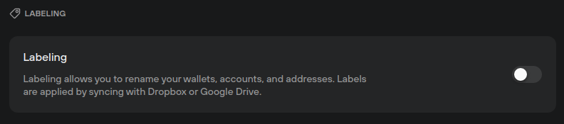

# Labeling

Labeling is a tool that helps you stay organized.

Rename your wallets, accounts, and addresses to keep track of your portfolio, separate transactions based on their sender, or make notes about transactions.

Labels are synced to your Google Drive or Dropbox account, or they can be stored locally. All the information you add is automatically encrypted by a key derived from your Trezor device.

#### **Turning on Labeling**

* Go to **Settings (⚙️) > Application**
* Click the toggle to turn labeling on or off:

<figure><figcaption></figcaption></figure>

When labeling is turned off, accounts will be named according to Trezor Suite defaults (transaction addresses use a long string of letters and numbers). When labeling is turned on, you can change the name to anything that helps you stay organized.

#### **Storing labels**

You can save these labels with a Dropbox or Google Drive account, or you can store the information locally on your computer. If you store it locally, you will not be able to access your labels while using Trezor Suite on another device.

> 💡 Learn more about [labeling](https://trezor.io/guides/trezor-suite/trezor-suite-desktop/labels-in-trezor-suite) on the Trezor knowledge base
