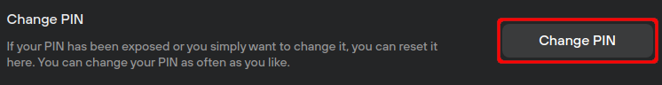

# Set a device PIN

Your PIN is a critical security feature and should be enabled before sending any coins to the device.

**Your PIN should be memorable,** as it cannot be recovered if forgotten. However, as long as you have a copy of your recovery seed (and passphrase is used) access to your funds can still be restored.

#### **Setting a PIN**

During the onboarding process, you will be prompted to set a PIN.

**Your PIN should be at least 4 digits long.** All Trezor hardware wallets support a PIN up to 50 digits.

If you skipped this step during onboarding, you can set your PIN from the Trezor Suite Dashboard or through the **Device settings** menu.

#### **Changing a PIN**

You can change a PIN at any time via ⚙️ **Settings > Device**. The process of setting a PIN is different for each Trezor model:

#### **Trezor Model One**

To set a new PIN on your Trezor Model One:

* Click **Change PIN** in the **Device settings** menu:

<figure><figcaption></figcaption></figure>

* Confirm the action on your Trezor.
* Enter the old PIN using the numbers shown on your Trezor and the grid shown on the computer.
* Enter the new PIN in the same way.
* Confirm the new PIN.

#### **Trezor Model T**

To set a new PIN on your Trezor Model T:

* Click **Change PIN** in the **Device Settings** menu.
* Confirm the action on your Trezor.
* Enter the old PIN using the Trezor touchscreen.
* Enter the new PIN in the same way.
* Confirm the new PIN.

#### **Trezor Safe 3**

To set a new PIN on your Trezor Safe 3:

* Click **Change PIN** in the **Device Settings** menu.
* Confirm the action on your Trezor.
* Enter the old PIN using the buttons on your Trezor.
* Enter the new PIN in the same way.
* Confirm the new PIN.

#### **Trezor Safe 5**

To set a new PIN on your Trezor Safe 5:

* Click **Change PIN** in the **Device Settings** menu.
* Confirm the action on your Trezor.
* Enter the old PIN using the buttons on your Trezor.
* Enter the new PIN in the same way.
* Confirm the new PIN.

> 💡 Learn more about [PIN protection on Trezor devices](https://trezor.io/learn/a/pin-protection-on-trezor-devices) on the Trezor knowledge base
