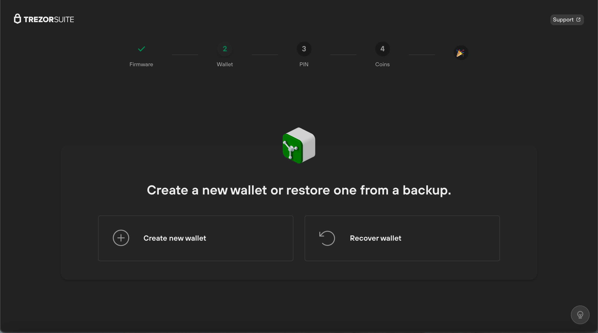

# Recover a wallet

**Recovery** refers to the process of using a wallet backup (recovery seed) to restore and enable access to your existing accounts.

* If you have a brand-new device, you can recover an existing wallet using your wallet backup (recovery seed).
* If you're locked out of your Trezor (e.g. you forgot your PIN) or you wish to load a different seed onto your device, you first need to **wipe** the device and then proceed with the recovery process.

#### Recovery process

When setting up your device, in the second step you will be asked to choose between **'Create new wallet'** or **'Recover wallet':**

<figure><figcaption></figcaption></figure>

* Select **'Recover wallet'**
* Then choose **'Start recovery'**
* Confirm **'Do you really want to recover a wallet?'** on your Trezor device
* Select the number of words in your wallet backup (recovery seed)
* Follow the on-screen instructions for entering your backup
* After successfully entering your backup, you can proceed with the remaining device initialization steps

Once you've completed the device setup, you'll be able to access the bitcoin and cryptocurrency funds that are associated with that specific backup.

> 💡 Learn more about [recovery processes](https://trezor.io/learn/c/trezor-recovery) on the Trezor knowledge base.
