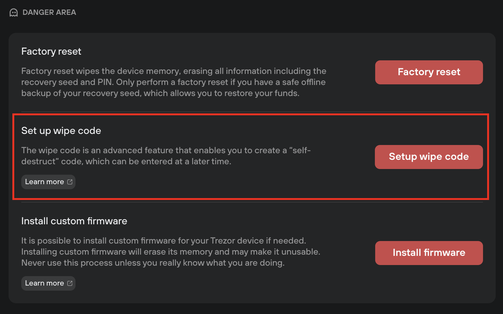
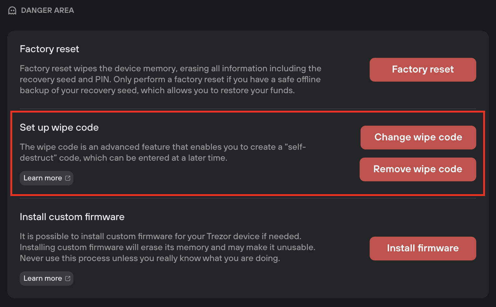

# Set a wipe code

Wipe code is an **advanced user feature** that lets you set a "self-destruct" PIN code.

> ⚠️ Before setting a wipe code, **make sure you check the validity of your recovery seed!**

Once set, you can enter the wipe code in the PIN dialog whenever you connect your device. When the wipe code is entered, the device immediately **erases all private data including the wallet backup (recovery seed).**

Wipe code settings are found via ⚙️ **Settings > Device** in the **Danger Area:**

<figure><figcaption></figcaption></figure>

**Setting a wipe code:**

* Click **Setup wipe code**
* On your Trezor device, select **Turn on**
* Enter your device PIN
* Enter a **new wipe code**
* Re-enter the new wipe code, to confirm it is correct
* Click **Continue** on your Trezor
* Suite will then display the notification **'Wipe code changed successfully'**

With a wipe code enable, Suite will display the options to **Change wipe code** and **Remove wipe code:**

<figure><figcaption></figcaption></figure>

**Changing a wipe code:**

* Click **Change wipe code**
* On your Trezor device, select **Change**
* Enter your device PIN
* Enter a new **wipe code**
* Re-enter the new wipe code, to confirm it is correct
* Click **Continue** on your Trezor
* Suite will then display the notification **'Wipe code changed successfully'**

**Removing a wipe code:**

* Click **Remove wipe code**
* On your Trezor device, select **Turn off**
* Enter your device PIN
* Click **Continue** on your Trezor
* Suite will then display the notification **'Wipe code removed successfully'**

> 💡 Learn more about the [wipe code](https://trezor.io/learn/a/create-wipe-code-to-erase-device) feature on the Trezor knowledge base
