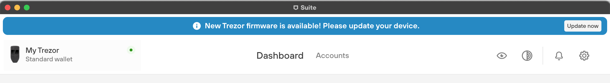

# Install firmware

Updating the device firmware is necessary to expand the functionality of your Trezor, to apply new security measures, and to enable newly developed features.\
\
When a new firmware version is released, [Trezor Suite](https://suite.trezor.io/) will display a notification along the top of the interface:

<figure><figcaption></figcaption></figure>

To update the device firmware, simply click on **'Update now'** and follow the on-screen and on-device instructions.

> **Note**\
> Learn more about [updating Trezor device firmware](https://trezor.io/learn/a/update-trezor-device-firmware) on the Trezor knowledge base


Learn more about [updating Trezor device firmware](https://trezor.io/learn/a/update-trezor-device-firmware) on the Trezor knowledge base

