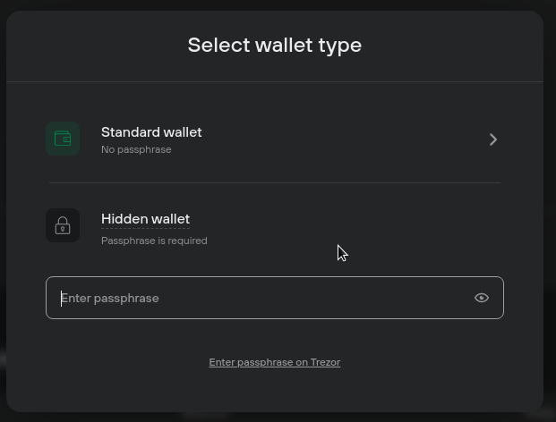

# Passphrase

A passphrase functions like an extra word added to your recovery seed. Each unique combination of recovery seed + passphrase grants access to the corresponding, unique **hidden wallet.**

Passphrases are not stored on your Trezor, and using a strong passphrase means your coins are extra safe.

> WARNING **If you forget a passphrase, you lose access to any associated funds.** Only use the feature once you understand how it works.

#### Critical information about passphrases

* Passphrases are not stored anywhere on the device. A passphrase cannot be recovered.
* A passphrase can be any character or set of characters, a word, or a sentence up to 50 bytes long (\~50 [ASCII](https://ascii.cl/) characters).
* Passphrases are case-sensitive - lowercase and uppercase characters are distinguished and count as different.
* Spaces are counted as valid characters.
* Your passphrase and recovery seed are used together. Neither can be used without the other. Coins sent to a passphrase-protected wallet can only be recovered with access to the seed and passphrase.
* There is no limit to the number of passphrase-protected wallets that can be used.
* Entering the 'wrong' passphrase will still create a protected wallet, there is no error message to indicate you mistyped it.

#### Create a passphrase-protected hidden wallet in Trezor Suite

When you start Trezor Suite and connect your device, you will see the **'Select wallet type'** modal window:

<figure><figcaption></figcaption></figure>

* Type your memorable passphrase into the _'Enter passphrase'_ input field.
* Confirm the passphrase using your Trezor device.
* Trezor Suite then runs the coin discovery process to find your accounts and balances; if the hidden wallet is empty, you must then type the same passphrase in the **'Confirm empty hidden wallet'** modal window and confirm it using your Trezor.

Hidden wallets can be loaded at any time by clicking on the device button in the top-left corner of the Suite interface, selecting **'+ Add wallet',** and then typing in the _exact_ passphrase.


Learn more about [passphrases and hidden wallets](https://trezor.io/learn/a/passphrases-and-hidden-wallets) on the Trezor knowledge base.

