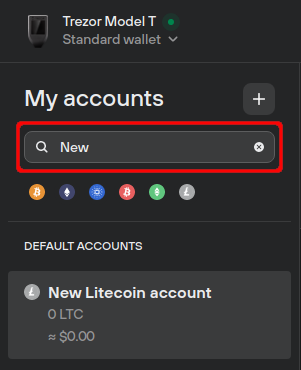

# Search for account

With labeling enabled, you can rename accounts in Trezor Suite to something more memorable.

If you need to search for a specific account, just type the name in the 'Search' input field at the top of the **'My accounts'** side menu in Suite:

<figure><figcaption></figcaption></figure>

The simple example above shows the result of searching for "New" for a user who has a Litecoin account named "New Litecoin account".

Search results are automatically filtered and displayed directly in the side menu.

> 💡 Learn more about [managing accounts in Suite](https://trezor.io/learn/a/manage-accounts-in-trezor-suite-app) on the Trezor knowledge base
