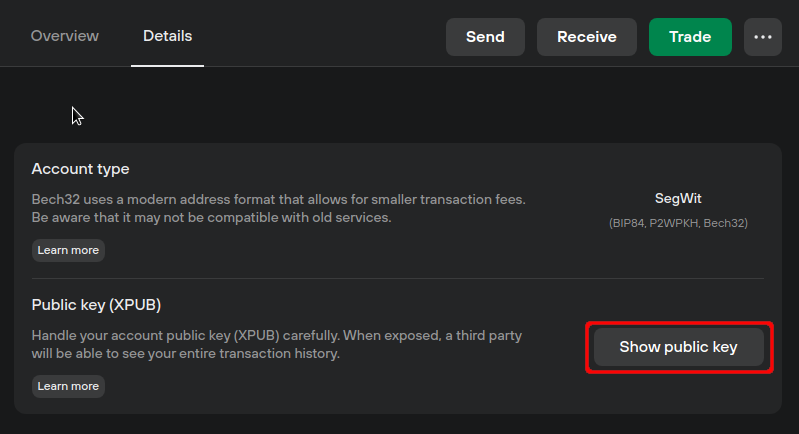

# Show public key

You can view your extended public key (XPUB) on the account's main page by switching to the account **Details** tab, and selecting **'Show public key'**:

<figure><figcaption></figcaption></figure>

Every account has its own unique XPUB, which makes it possible to see transactions going to and from the account. This is used to create 'watch-only' wallets that link all past, current, and future addresses used by the selected account.

While you can share this information in some scenarios, we recommend keeping it secret as it presents a privacy concern where others can view your balances and activity.

> LIGHTBULB Learn more about [public keys (XPUB)](https://trezor.io/learn/a/trezor-suite-app-public-keys-xpub) on the Trezor knowledge base
