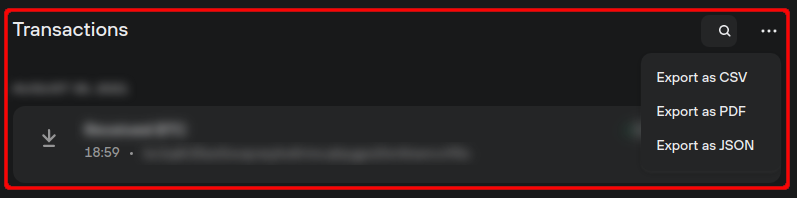

# Overview of transactions

Trezor Suite displays information about individual transactions for each of your cryptocurrency accounts.&#x20;

This information can be found in the **Transactions** section of the account Overview, directly underneath the graph view:

<figure><figcaption></figcaption></figure>

You can export the list of transactions to CSV, PDF or JSON via the ellipsis menu.

Each entry displays the transaction timestamp, address, and amount. More detailed information can be seen by clicking on the entry.


Learn more about [addresses and transaction history](https://trezor.io/learn/a/addresses-transaction-history) on the Trezor knowledge base

