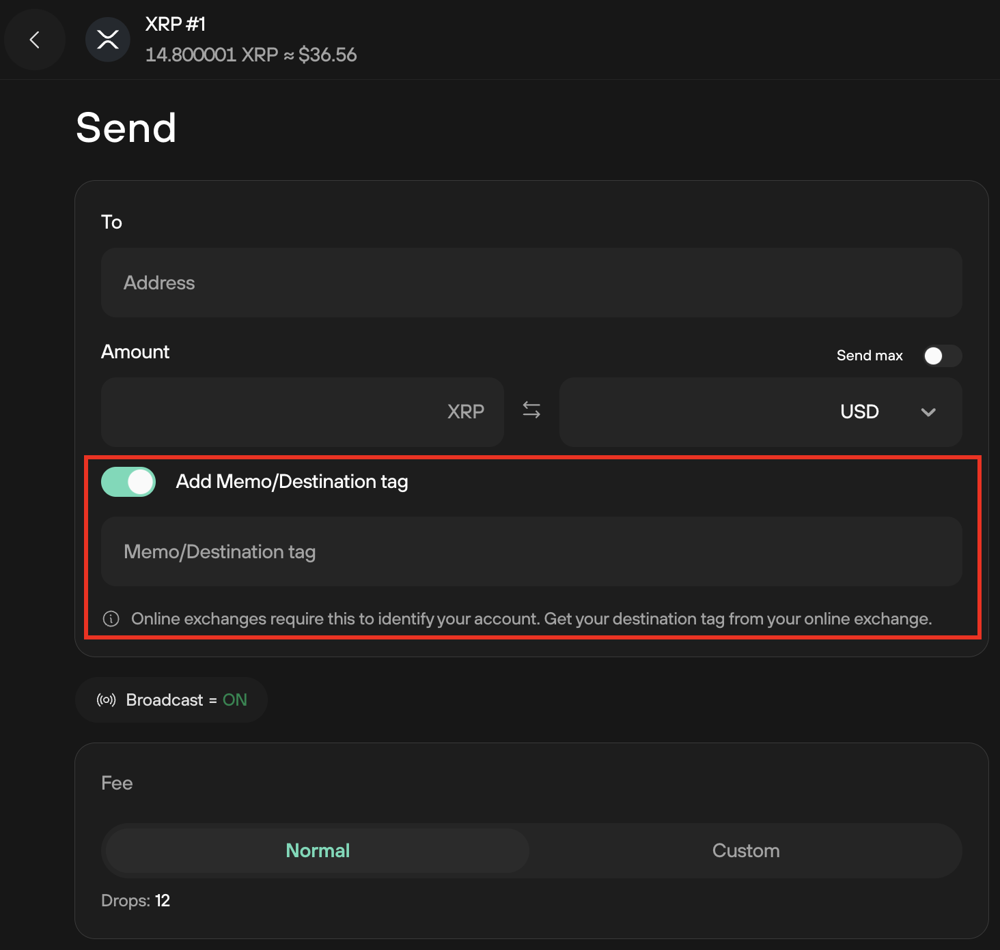

# Destination tags

A **destination tag** (or **Memo**) is a unique identifier used to specify the recipient of a transaction when sending funds to an exchange or a hosted wallet. Since many users share the same deposit address on these platforms, the destination tag ensures that the funds are credited to the correct account; without it, transactions may be delayed or lost.

Trezor devices support multiple blockchains that use Destination Tags. However, only XRP and XLM are supported directly within Trezor Suite. Other blockchains (e.g.  ZetaChain, KAVA, EOS, dYdX, and Axelar) are supported by Trezor firmware, but require a third-party app for transacting. Since the process for including destination tags varies between wallets, please check the documentation of the third-party wallet you’re using to ensure all transactions are processed correctly.

#### Receiving funds

You don’t require a destination tag to receive funds in Trezor Suite. However, some exchanges require one when withdrawing to your wallet. If prompted, you can enter any number (e.g., 12345), as Trezor Suite does not use destination tags for receiving funds.

#### Sending funds

Exchanges usually display the required destination tag next to the deposit address. **Always review their instructions before sending.**

When sending e.g. an XRP transaction, the destination tag can be included by toggling on the **Add Memo/Destination tag** option:&#x20;

<figure><figcaption></figcaption></figure>

A text box will appear where you can type or paste the destination tag given to you by the exchange or recipient.

This process is the same for XLM and all other blockchains that use Destination Tags.

> 💡 Learn more about [Destination Tags](https://trezor.io/learn/a/destination-tags) on the Trezor knowledge base
