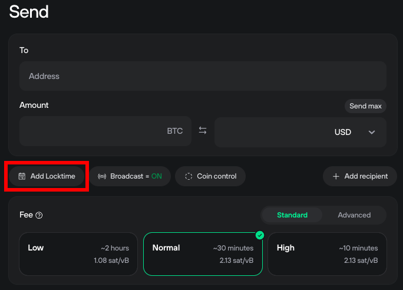
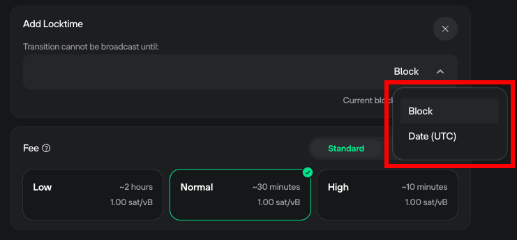

# Locktime

Locktime creates a transaction that only broadcasts when a certain time or block height has been reached. Setting a locktime is as simple as stating a blockheight or date at which it should broadcast, and then signing the transaction as usual.

Broadcast is turned off by default when using locktime, meaning you will receive raw text data to broadcast from a node. If Broadcast is on, the transaction will be sent over the current network.

#### How to set a locktime

To set a Locktime while creating a transaction:

1. Click **Add Locktime:**

<figure><figcaption></figcaption></figure>

2. Use the drop-down menu to set the Locktime format to either **Block** or **Date (UTC):**&#x20;

<figure><figcaption></figcaption></figure>

3. Enter a block height or date when it should broadcast.
4. Set a fee.
5. Confirm transaction details on your Trezor.
6. You will be shown confirmation details.
7. Copy the data to your clipboard or save it as a text document. When broadcasting (only after the block height has been reached) click Send instead.
8. Later, ideally from another network, use Send RAW or visit a block explorer to send the raw transaction data.

> 💡 Learn more about the [locktime feature](https://trezor.io/guides/trezor-suite/trezor-suite-desktop/locktime-in-trezor-suite) on the Trezor knowledge base
