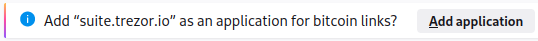
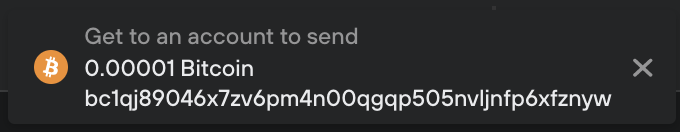
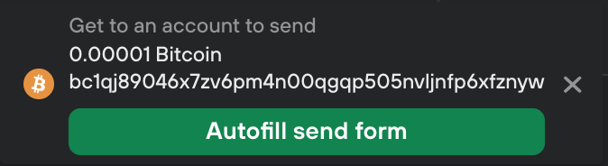

# URI handlers

The URI scheme makes it easier for users to make Bitcoin payments either by clicking a link on a webpage or scanning a QR code. This functionality has also been extended to Bitcoin-like altcoins.

To use the Trezor Suite web application as a URI handler, when you first start the application click on **Add application** when prompted to add “[suite.trezor.io](http://suite.trezor.io/)” as an app for handling Bitcoin links:

Clicking on a URI will auto-complete the **‘Send’** transaction fields using the details specified in the URI.

Trezor Suite will then ask you to navigate to a suitable account from which you can send the requested funds:

Once you’ve selected the desired account, go to the **Send** tab, and the pop-up in Trezor Suite will then give you the option to **Autofill send form:**

After clicking on the autofill button the input fields for the **Send** transaction will be populated accordingly, and you can then proceed by clicking **Review & Send.**


Learn more about [URI handlers in Trezor Suite](https://trezor.io/learn/a/uri-handlers-for-bitcoin-payments) on the Trezor knowledge base

