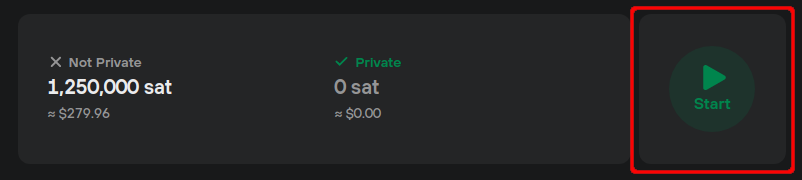
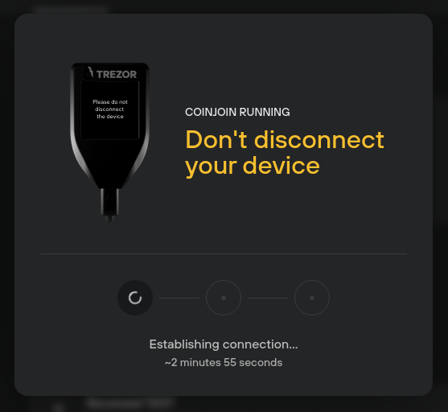
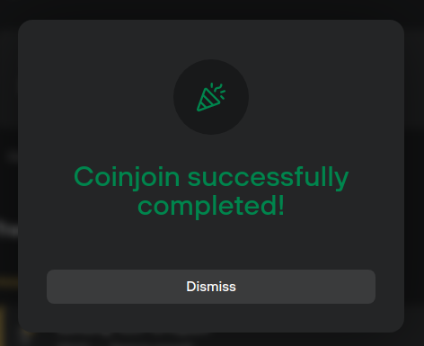

# Start coinjoin

Once you've added bitcoin to your coinjoin account, you can begin the process of making these funds private:

### Running coinjoin in Trezor Suite

* Start the coinjoin process by selecting **Start:**

<figure><figcaption></figcaption></figure>

* Check the confirmation box; then click **'Start coinjoin'** and **confirm on your Trezor** device that you want to take part in a series of coinjoin rounds. **Hold to confirm** and Trezor Suite will start looking for a coinjoin round.

While coinjoin is running, keep your Trezor connected and Trezor Suite running in the background. **Do not disconnect your device when you see the following prompt** (otherwise you may be prevented from joining future coinjoin rounds):

<figure><figcaption></figcaption></figure>

* At the end of the coinjoin process, if you have achieved the desired anonymity for all coins, you will see the following confirmation dialogue:

<figure><figcaption></figcaption></figure>

If you have not anonymized 100% of the funds in your coinjoin account, you can simply re-run the coinjoin process.

> LIGHTBULB Learn more about [coinjoin](https://trezor.io/learn/a/coinjoin-in-trezor-suite) on the Trezor knowledge base
