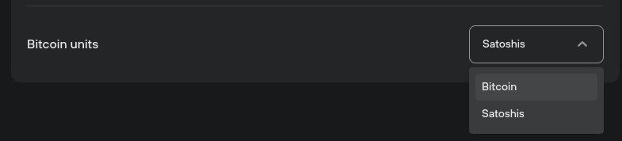

# Express BTC values in sats

Bitcoin account balances and transaction values in Trezor Suite can be shown in either BTC or Satoshis (sat). For example, if you have 0.1 BTC, it would be shown as 10,000,000 sat.

For account balances, users can toggle between the two modes directly in the Trezor Suite Dashboard by clicking on the ‘Balance’ shown in the Assets overview table.

Preferences can also be changed via the **Application settings** menu:

* Click on the gear icon (⚙️) in the top-right corner of Trezor Suite to access the Settings menu
* In the **Localization** section, use the drop-down menu for **‘Bitcoin units’** to switch between Bitcoin and Satoshis:

<figure><figcaption></figcaption></figure>

> 💡 Learn more about [Trezor Suite](https://trezor.io/learn/a/trezor-suite-app-settings) on the Trezor knowledge base
