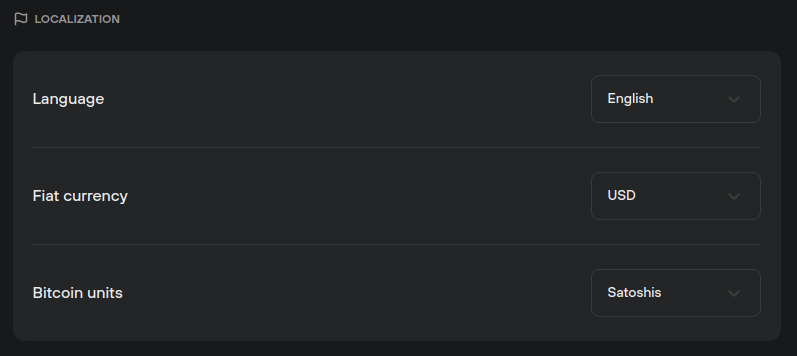

# Localization

The **Localization** menu lets users make quick adjustments to Trezor Suite, allowing for a more personalized user experience. It can be found in **Settings (**⚙️**) > Application:**

The following settings can be changed:

* **Language:** Suite is currently available in English, Spanish, Czech, Japanese (beta), and Russian.
* **Fiat currency:** Switch to local currency, or any other that you prefer.
* **Bitcoin units:** Display your bitcoin account balances in either BTC or sats.

Preferences can be set by choosing from the options available in the drop-down menus.&#x20;


Learn more about [Trezor Suite](https://trezor.io/learn/a/trezor-suite-app-settings) on the Trezor knowledge base&#x20;

