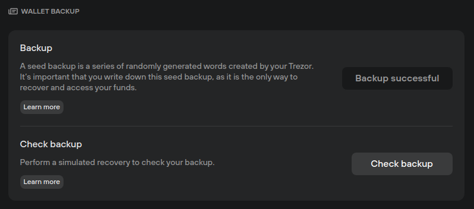
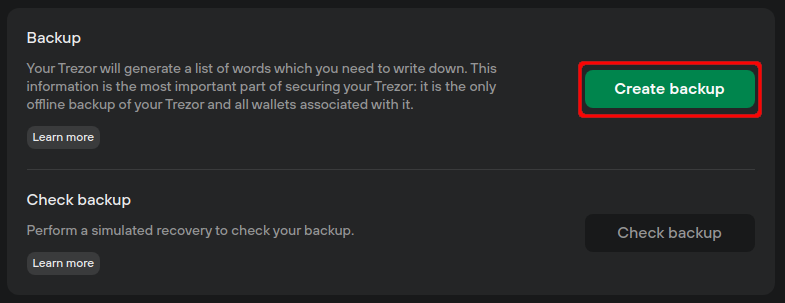

# Wallet backup

**Wallet backup** operations can be found under **Settings (⚙️) > Device**, at the top of the page:

<figure><figcaption></figcaption></figure>

**Backup**: informs you of the status of your Trezor device backup, i.e., whether or not you've set up your **recovery seed.**

* If you've already created your backup, you'll see the grayed-out **'Backup successful'** button.
* If you have not already created your backup, please click on **Create backup** and set it up **as soon as possible:**

<figure><figcaption></figcaption></figure>

**Check backup:** click on **'Check backup'** to perform a simulated wallet recovery process, which allows you to check the validity of your recovery seed.

> 💡 Learn more about [wallet backups](https://trezor.io/learn/a/trezor-suite-app-settings#Wallet\_backup) on the Trezor knowledge base
