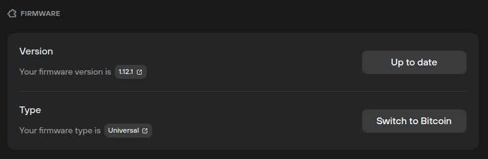

# Firmware

Firmware settings are accessed via **Settings (⚙️) > Device,** then scrolling down to the **Firmware** section:

<figure><figcaption></figcaption></figure>

**Version:** displays firmware version currently installed.

* If you're running the latest firmware, the button reads **'Up to date'.**
* If an update is available, click on **'Update available'** and follow the on-screen instructions to install the latest Trezor device firmware.

**Type:** displays which firmware type is installed on your device.

* **Universal:** supports all cryptocurrencies available on Trezor. If you only need to trade bitcoin, click on **'Switch to Bitcoin'** and follow the on-screen instructions to install Bitcoin-only firmware.
* **Bitcoin-only:** your Bitcoin accounts and balances will be shown, but all other coins will be deactivated. If you need to trade other cryptocurrencies, you will need to install the Universal firmware by clicking on **'Switch to Universal'** and following the on-screen instructions.

> 💡 Learn more about [firmware settings](https://trezor.io/learn/a/trezor-suite-app-settings#Firmware) on the Trezor knowledge base
