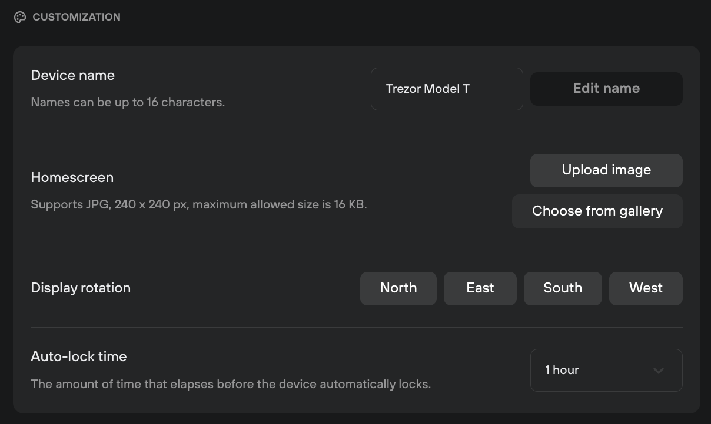

# Customization

Customization settings are accessed via **Settings (⚙️) > Device,** then scrolling down to the **Customization** section:

<figure><figcaption></figcaption></figure>

* **Device name:** displays the name of your Trezor hardware wallet. Click on **'Edit name'** to rename your device.
* **Homescreen:** select **'Upload image'** to set a custom background to personalize your Trezor, or click **'Choose from gallery'** and pick from the standard selection of images.
* **Display rotation (Model T, Trezor Safe 5):** change the orientation of the display on your Trezor.
* **Auto-lock time:** change how long it takes for the device to automatically lock.

> 💡 Learn more about [customizing Trezor Suite](https://trezor.io/guides/trezor-suite/trezor-suite-desktop/trezor-suite-settings#Customization) on the Trezor knowledge base
