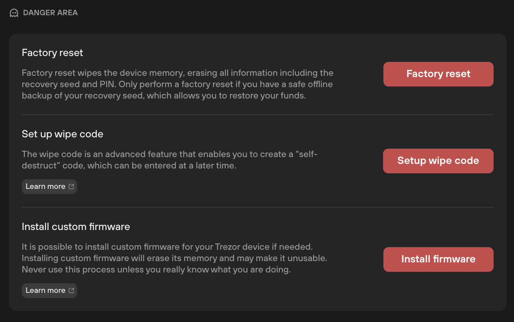

# Danger Area

> ⚠️ Make sure you know exactly what you're doing before performing these operations!

Danger Area settings are accessed via **Settings (⚙️) > Device,** then scrolling down to the **Danger Area** section:

<figure><figcaption></figcaption></figure>

* **Factory reset:** performing a factory reset will erase all information from your Trezor device.
* **Set up wipe code:** this advanced feature lets you create a "self-destruct" code; when entered, your Trezor will immediately delete all private data **including your recovery seed**.
* **Install custom firmware:** this option lets you install custom firmware, for example if you want to downgrade the firmware installed on your Trezor.

> 💡 Learn more about [danger area settings](https://trezor.io/learn/a/trezor-suite-app-settings#Danger\_area) on the Trezor knowledge base
