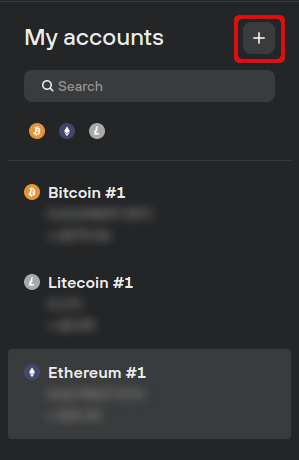
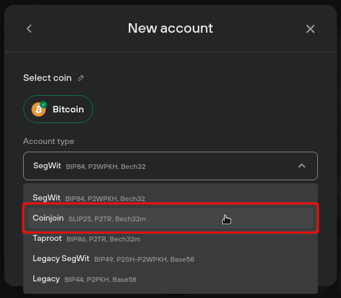
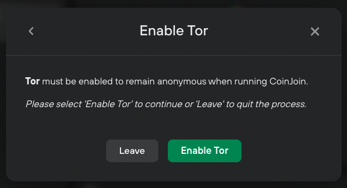

# Add a coinjoin account

### Adding a coinjoin account in Trezor Suite:

* At the top of the **'My accounts'** menu bar, press the plus (➕) sign:

* In the **'Account type'** drop-down menu, select **'Coinjoin account':**;

* Then select **'Add account'**
* If you do not have Tor enabled, follow the prompt to **'Enable Tor':**

💡 Tor must be enabled for coinjoin to work. You can [learn more about Tor](https://trezor.io/learn/a/tor-in-trezor-suite-app) on the Trezor knowledge base.

* Your Trezor will then ask you to allow access to your coinjoin account. Press the green check mark (✅) to confirm.
* Trezor Suite will then run a coinjoin account discovery, **which may take significantly longer than regular account discovery**. After successful completion, your coinjoin account is ready to receive funds.

It is recommended to use a **minimum of 10,000 sats** for coinjoin. Ideally, the **total value** of your coinjoin input should be **1,000,000 sats or more,** otherwise coinjoin may be inefficient.

💡 You can [learn more about coinjoin](https://trezor.io/learn/a/coinjoin-in-trezor-suite) on the Trezor knowledge base.
