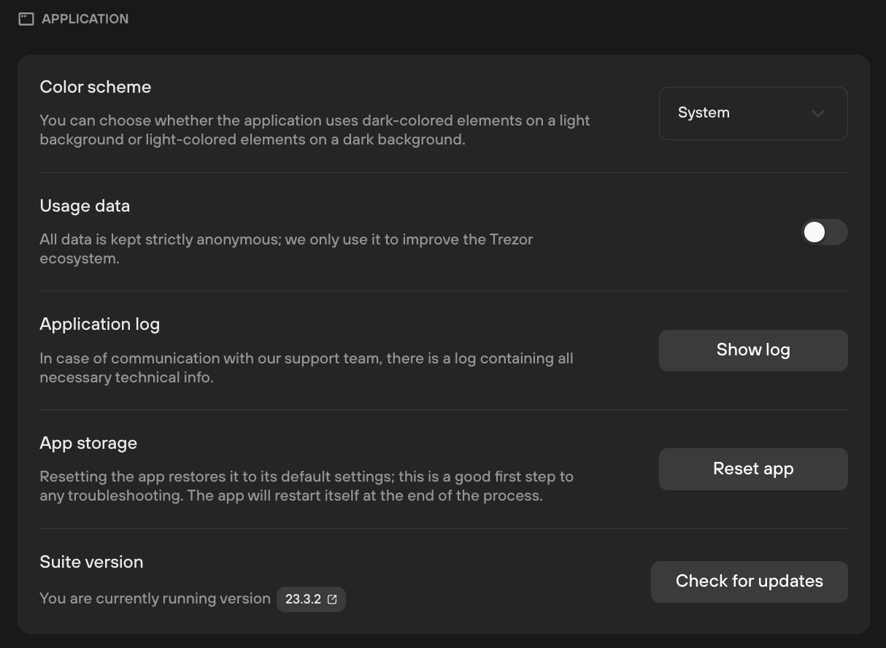

# Application

Application settings for Trezor Suite are access via **Settings (**⚙️**) > Application,** and scrolling down to the **Application** category:

<figure><figcaption></figcaption></figure>

The following options are available:

* **Color scheme:** change between light and dark mode, depending on your preferences.
* **Usage data:** if this is turned on, you send us anonymous user data that helps to improve Trezor products.
* **Application log:** in case of technical issues, you can download an application log to send to Trezor Support for troubleshooting.
* **App storage:** select 'Reset app' to restore Trezor Suite to its default settings - this can help with troublehsooting minor technical issues.
* **Suite version:** here you can check which version of Suite you're using, and check for any new updates. You can also click on the version number to view the release notes on Github.


Learn more about [Trezor Suite](https://trezor.io/learn/a/trezor-suite-app-settings) on the Trezor knowledge base&#x20;

