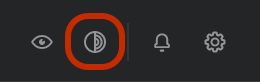

# Tor

The Tor switch is a privacy feature available in the **Trezor Suite desktop app**. Tor enhances user privacy by making it very difficult to trace your connection to any one country, location or IP address.

#### Enabling Tor in Trezor Suite

To activate Tor, **click on the Tor icon** on the right-hand side of the top toolbar:&#x20;

<figure><figcaption></figcaption></figure>

Then wait a few seconds for a connection to be established.

Once connected, a green tick will appear on the icon. All network traffic from Trezor Suite will now be routed through Tor.

💡 Tor routes connections across a greater distance and through multiple nodes, so there may be increased latency for any actions that transmit data across the network.

#### Custom settings for Tor

If you would like to connect to a specific Tor instance, you can change the IP address from the default. You can also open any of the [trezor.io](http://trezor.io) links as .onion links. These links are the .com of the Tor network and enabling them will prevent observers from seeing what links you visit from the app, such as the SatoshiLabs block explorer.


Learn more about [Tor in Trezor Suite](https://trezor.io/learn/a/tor-in-trezor-suite-app) on the Trezor knowledge base

