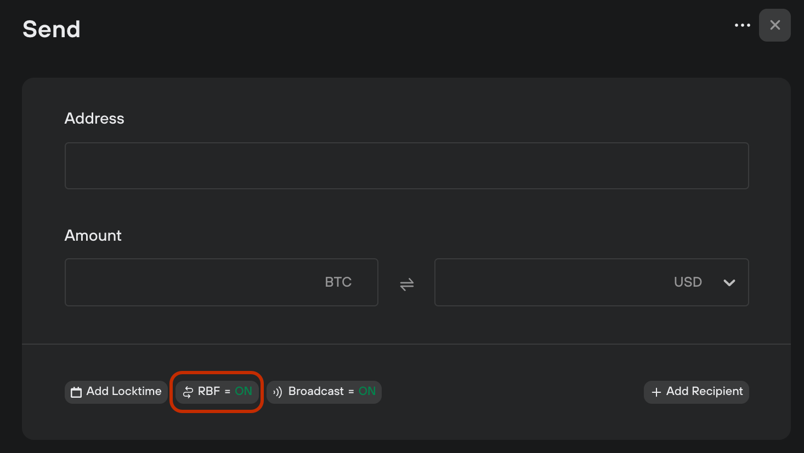

# Replace by Fee (RBF)

Replace by fee, or **RBF**, lets you set a condition that allows a transaction be replaced by another which is identical in all aspects but has a **higher miner fee** assigned to it. This can be done multiple times while the transaction is unconfirmed.

RBF means you can **accelerate a transaction** and have it added to the next block. The feature can also be used to **finalize a transaction.**

### **Using RBF in Trezor Suite**

RBF is enabled by default in Trezor Suite. To turn it off, click on the RBF toggle before sending a transaction:

<figure><figcaption></figcaption></figure>

#### Bump a transaction fee

Increase the fee allocated to any unconfirmed RBF transaction by clicking **Bump fee** on the pending transaction in the **Overview** tab.

A dialog will open that lets you assign a new fee, which must be higher than the previous one. Click **Replace transaction** and then confirm the action on your Trezor.

#### Finalizing a transaction

Some merchants accept Bitcoin transactions without needing them to fully confirm, but only if the transaction is not replaceable.

If this is the case, and your transaction is staying unconfirmed longer than expected, then instead of waiting for the transaction to confirm, you can select **FInalize transaction**.&#x20;

This replaces the transaction with one that has RBF disabled and a final fee allocated to it. The fee cannot be increased any further once finalized, so set it appropriately.


Learn more about [replace by fee (RBF)](https://trezor.io/learn/a/rbf-in-trezor-suite-app) on the Trezor knowledge base

