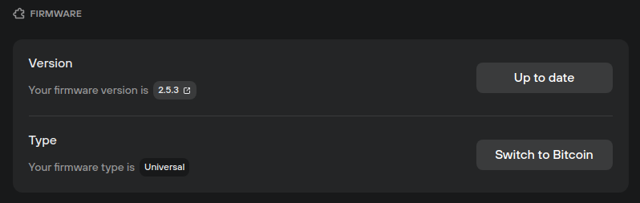
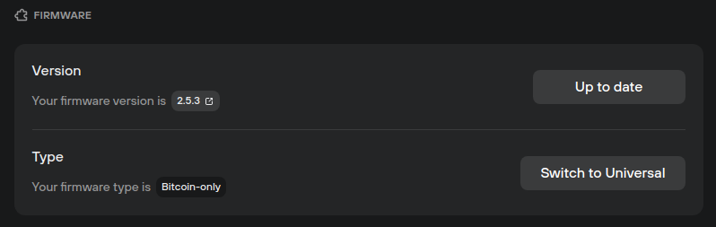

# Bitcoin-only firmware

When initializing new Trezor devices, users can choose between Universal and Bitcoin-only firmware during the onboarding process in the **‘Firmware installation’** step.

If the device is already set-up with Universal firmware, you can switch to Bitcoin-only firmware in the **Device settings** menu:

* Click on the gear icon (⚙️) in the top-right corner of Trezor Suite to access the **Settings** menu
* In the **‘Device’** menu, scroll down to the **‘Firmware’** section
* Here you will see details of both the **version** and **type** of firmware installed:

<figure><figcaption></figcaption></figure>

* Click the **‘Switch to Bitcoin’** button and follow the instructions displayed in Trezor Suite and on your Trezor device screen.

With Bitcoin-only firmware installed, your Bitcoin accounts and balances will be shown, but all other coins will be deactivated. You will not lose any other currencies by installing Bitcoin-only firmware - they will simply not be discovered by Trezor Suite, and therefore will not be displayed.

If you wish to trade other cryptocurrencies, you will need to install the Universal firmware:

* Click on the gear icon (⚙️) in the top-right corner of Trezor Suite to access the **Settings** menu
* In the **‘Device’** menu, scroll down to the **‘Firmware’** section
* Here you will see details of both the **version** and **type** of firmware installed:

<figure><figcaption></figcaption></figure>

* Click the **‘Switch to Universal’** button and follow the instructions displayed in Trezor Suite and on your Trezor device screen.


Learn more about [device firmware](https://trezor.io/learn/a/bitcoin-only-firmware-on-trezor) on the Trezor knowledge base

