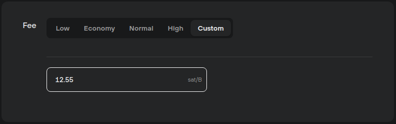

# Settings fees with decimals (Bitcoin transactions)

When sending Bitcoin funds in Trezor Suite, users can now set non-integer custom fees to two decimal places.

To do so, in the **Fee** section of the **Send** transaction tab, select the **Custom** fee option and enter the desired amount in sat/B, for example:

<figure><figcaption></figcaption></figure>

As can be seen in the example, fee rates are costed per byte of data, rather than the amount of Bitcoin being sent.

💡 If a very low (or no) fee is set, it is highly unlikely that the transaction will be mined. Also note that the lowest accepted fee rate by nodes is 1 sat/B.

If you’re unsure whether the fee is high enough, make your transaction fee ‘replaceable’ by ensuring that **replace by fee (RBF)** is ON, so that you can ‘top up’ the fee even after sending the transaction.


Learn more about [transaction fees](https://trezor.io/learn/a/transaction-fees-in-trezor-suite-app) on the Trezor knowledge base

