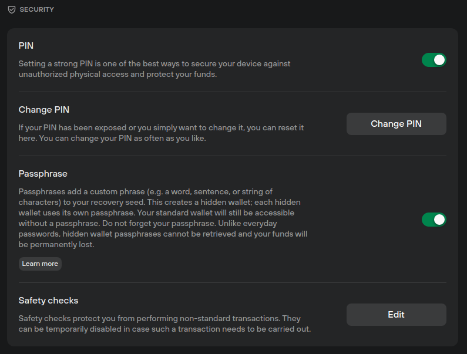

# Security

xx

<figure><figcaption></figcaption></figure>

* here you can check which version of Suite you're using, and check for any new updates. You can also click on the version number to view the release notes on Github.


Learn more about [Trezor Suite](https://trezor.io/learn/a/trezor-suite-app-settings) on the Trezor knowledge base&#x20;

